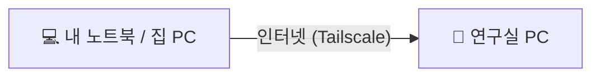

# 🐣 시작하기 전에 (5분만 읽어 주세요)

> 컴퓨터를 잘 몰라도 괜찮아요. 이 페이지에 나오는 **기본 동작 몇 가지**만 알면 쉬운 가이드를 끝까지 따라 할 수 있어요.

[← 처음으로](../README.md)

---

## 1. 우리가 만들 것



설정이 끝나면 집에서 이 두 가지를 할 수 있어요.

| | 무엇을 하나요? | 어떻게 보이나요? |
|---|---|---|
| **🖥️ 원격 데스크톱** (RustDesk) | 연구실 PC 화면을 내 노트북에 **그대로** 띄우고, 마우스와 키보드로 조작 | 연구실 바탕화면이 창 하나로 보여요 |
| **⌨️ SSH** | 연구실 PC에 **명령어**를 보내요 | 검은 창에 글자만 보여요 |

---

## 2. 준비물

- [ ] **연구실 PC**와 **내 노트북**(또는 집 PC). 처음에는 **두 컴퓨터를 모두 앞에 두고** 시작해요. 연구실에서 하면 돼요.
- [ ] **Google 계정** 하나. 두 컴퓨터에서 **같은 계정**으로 로그인해야 해요.
- [ ] 연구실 PC의 **로그인 비밀번호**
- [ ] 시간 **40분 정도**
- [ ] 메모할 곳 (종이나 휴대폰 메모 앱)

> ⚠️ 학교에 따라 원격 접속 프로그램 설치를 막는 곳도 있어요. 걱정되면 교수님이나 전산팀에 먼저 물어보세요.

---

## 3. 📝 메모 카드

가이드를 따라 하면서 아래 값을 **종이나 휴대폰 메모 앱**에 적어 두세요.

| 📝 적을 것 | 내 값 | 어디서 알 수 있나요? |
|---|---|---|
| 연구실 PC 주소 (Tailscale IP) | `100.___.___.___` | 가이드 1️⃣단계 |
| 연구실 PC 사용자명 | `__________` | 가이드 4️⃣단계 |
| 연구실 PC 비밀번호 | (적지 말고 기억만 하기) | 원래 쓰던 비밀번호 |
| RustDesk 비밀번호 | `__________` | 가이드 RustDesk 설치 단계에서 직접 정해요 |

> 🚫 이 값들은 **깃허브, 카톡방, 블로그에 절대 올리지 마세요.**

---

## 4. "터미널" 여는 법

**터미널**은 컴퓨터에 **글자로 명령을 내리는 창**이에요. 대부분 검은색이나 보라색 창이에요.

### 🐧 우분투(Ubuntu)에서
키보드에서 **`Ctrl` + `Alt` + `T`** 를 동시에 누르면 터미널이 열려요.

### 🪟 윈도우(Windows)에서
1. 화면 왼쪽 아래(또는 가운데) **시작 버튼(윈도우 로고)을 마우스 오른쪽 버튼으로 클릭**해요.
2. 메뉴에서 골라요.
   - 그냥 쓸 때 → **`터미널`**
   - 가이드에 **"관리자"** 라고 적혀 있을 때 → **`터미널(관리자)`** → "이 앱이 변경하도록 허용하시겠어요?" → **예**
   - (메뉴에 `터미널`이 없으면 `Windows PowerShell`이나 `Windows PowerShell(관리자)`를 고르면 돼요.)

---

## 5. 명령어 복사해서 붙여넣기 ⭐ 가장 중요

가이드에 이렇게 **회색 상자**가 나오면, 그 안의 글자가 명령어예요.

```bash
echo 안녕하세요
```

### ① 복사하기
- 깃허브에서 회색 상자에 **마우스를 올리면 오른쪽 위에 📋 모양 버튼**이 생겨요. 누르면 상자 안의 명령어가 전부 복사돼요.

### ② 터미널에 붙여넣기
| 어디서? | 붙여넣기 방법 |
|---|---|
| 🐧 **우분투 터미널** | **`Ctrl` + `Shift` + `V`** ⚠️ 그냥 `Ctrl + V`는 안 돼요! (또는 마우스 오른쪽 클릭 → 붙여넣기) |
| 🪟 **윈도우 터미널** | **`Ctrl` + `V`** 또는 **마우스 오른쪽 클릭** |

### ③ 실행하기
붙여넣은 뒤 **`Enter`** 를 누르면 실행돼요.

### ④ 끝났는지 아는 법
명령이 끝나면 맨 아래에 **다시 입력할 수 있는 줄**(프롬프트)이 나타나요.
```
hong@lab-pc:~$ █          ← 우분투: 이렇게 $ 표시가 다시 나오면 끝
PS C:\Users\hong> █       ← 윈도우: 이렇게 > 표시가 다시 나오면 끝
```
글자가 계속 올라가는 중이면 **아직 실행 중**이에요. 기다려 주세요.

---

## 6. 비밀번호를 쳐도 아무것도 안 보여요 → 정상이에요! 🙆

터미널에서 비밀번호를 물어볼 때가 있어요.
```
[sudo] password for hong:
```
이때 비밀번호를 입력해도 **화면에 아무것도 안 나타나요. `****` 도 안 나와요.**
고장 난 게 아니에요. 보안 때문에 일부러 안 보이게 한 거예요. **그냥 끝까지 치고 `Enter`** 를 누르세요.

> 틀렸으면 `Sorry, try again.`이 나와요. 다시 입력하면 돼요.

---

## 7. 내 값으로 바꿔 넣어야 하는 부분

명령어에 아래 글자가 있으면 **메모 카드에 적은 내 값으로 바꿔서** 입력하세요.

| 가이드에 적힌 글자 | 바꿀 값 | 예시 |
|---|---|---|
| `100.x.x.x` | 연구실 PC의 Tailscale IP | `100.64.12.34` |
| `사용자명` | 연구실 PC의 사용자명 | `hong` |

**예시**
```
가이드:  ssh 사용자명@100.x.x.x
내 입력:  ssh hong@100.64.12.34
```
- 복사해서 붙여넣은 뒤 **방향키(← →)로 커서를 옮겨서** 고치면 편해요.
- `#` 뒤에 적힌 글자는 **설명(주석)** 이에요. 같이 붙여넣어도 아무 일도 안 일어나니 괜찮아요.

---

## 8. 처음 접속할 때 나오는 질문

SSH로 처음 접속하면 영어로 이런 질문이 나와요.
```
Are you sure you want to continue connecting (yes/no/[fingerprint])?
```
"처음 보는 컴퓨터인데 믿고 접속할래?"라는 뜻이에요. **`yes`** 라고 치고 `Enter`를 누르세요. (`y`만 치면 안 돼요. `yes`를 다 쳐야 해요.)

---

## 9. 글자가 잔뜩 나와도 겁먹지 마세요

설치할 때 영어 글자가 화면 가득 올라가는 건 **정상**이에요.
아래 단어가 보일 때만 주의해서 읽어 보세요.

| 이런 단어가 보이면 | 뜻 |
|---|---|
| `error`, `Error`, `ERROR`, `failed`, `E:` | 뭔가 실패했어요 → 가이드의 **❌ 안 되면** 부분을 보세요 |
| `warning`, `W:` | 경고예요. 대부분 **무시해도 괜찮아요** |
| `Permission denied` | 권한이 없거나 비밀번호가 틀렸어요 |

---

## 10. 막혔을 때

1. 가이드의 **❌ 안 되면** 부분을 먼저 봐요.
2. 그래도 안 되면 [문제 해결 모음](../guides/08-troubleshooting.md)을 봐요.
3. 누군가에게 물어볼 때는 **터미널 화면 전체를 캡처**해서 보여 주면 빨리 해결돼요. (단, 비밀번호나 IP가 보이면 가리고 보내세요.)
4. 모르는 단어가 나오면 → [📖 용어 사전](glossary.md)

---

## 🎯 이제 내 경우를 골라요

"**A → B**" = **A(내 노트북, 집 PC)** 로 **B(연구실 PC)** 에 접속한다는 뜻이에요.

| 내 노트북 / 집 PC | 연구실 PC | 쉬운 가이드 |
|---|---|---|
| 🐧 우분투 | 🪟 윈도우 | 👉 [우분투 → 윈도우](01-ubuntu-to-windows.md) |
| 🪟 윈도우 | 🪟 윈도우 | 👉 [윈도우 → 윈도우](02-windows-to-windows.md) |
| 🐧 우분투 | 🐧 우분투 | 👉 [우분투 → 우분투](03-ubuntu-to-ubuntu.md) |
| 🪟 윈도우 | 🐧 우분투 | 👉 [윈도우 → 우분투](04-windows-to-ubuntu.md) |

> 💡 **내 컴퓨터가 윈도우인지 우분투인지 모르겠다면?**
> 화면 왼쪽 아래(또는 가운데 아래)에 **네모 4개짜리 윈도우 로고**가 있으면 윈도우예요.
> 화면 왼쪽에 **세로로 아이콘이 쭉 있고**, 왼쪽 아래에 **점 9개 버튼**이 있으면 우분투예요.

[← 처음으로](../README.md)
