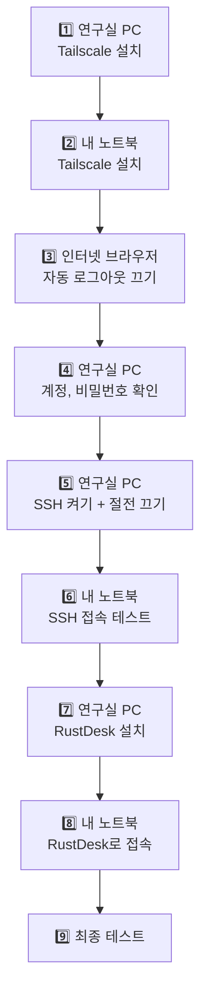

# 🐣 쉬운 가이드: 🪟 윈도우 노트북으로 🪟 윈도우 연구실 PC 쓰기

> **내 노트북(집 PC)도 윈도우**, **연구실 PC도 윈도우**일 때 보는 가이드예요.
> 끝까지 따라 하면 집에서 **연구실 바탕화면을 그대로 보면서** 쓸 수 있어요.

⏱ **걸리는 시간**: 약 40분
📍 **어디서**: **연구실에서** 시작하세요. 연구실 PC와 노트북을 둘 다 앞에 두고 해요.
📖 **처음이라면** [시작하기 전에](00-before-you-start.md)를 먼저 읽어 주세요. (터미널 여는 법, 붙여넣기 방법이 나와요)

[← 처음으로](../README.md)

---

## 🗺️ 전체 순서



단계마다 **📍 어느 컴퓨터에서 하는지** 적혀 있어요. 두 컴퓨터가 **둘 다 윈도우라서 헷갈리기 쉬우니** 꼭 확인하고 진행하세요.

---

<a id="step1"></a>
## 1️⃣ 연구실 PC에 Tailscale 설치하기

> 💬 **이게 뭐예요?** Tailscale은 내 컴퓨터들끼리 **비밀 통로**를 만들어 주는 무료 프로그램이에요.
> 학교 밖에서도 연구실 PC를 찾아갈 수 있게 해 줘요.

📍 **연구실 윈도우 PC**에서

1. 인터넷 브라우저(크롬, 엣지)를 열고 주소창에 **`tailscale.com/download`** 입력 → `Enter`
2. **Download Tailscale for Windows** 버튼을 눌러요.
3. 다운로드된 파일을 열어요 → 설치 창에서 **동의(I agree)** → **Install** → 설치가 끝날 때까지 기다려요.
4. 화면 오른쪽 아래 작업 표시줄에 Tailscale 아이콘이 생겨요. (안 보이면 **`^` 모양 버튼**을 눌러 보세요)
5. 아이콘을 클릭 → **Log in** → 브라우저가 열리면 **Sign in with Google** → 내 구글 계정으로 로그인 → **Connect**
6. ⭐ 아이콘을 **마우스 오른쪽 클릭**(또는 클릭) → **Settings**(또는 **Preferences**) → **Run unattended** 에 체크 ✅
   > 💬 이걸 켜야 연구실 PC가 재부팅된 뒤 **아무도 로그인하지 않아도** Tailscale이 켜져요.

**연구실 PC 주소(IP) 확인**
시작 버튼 **오른쪽 클릭** → **터미널** → 아래를 붙여넣기(`Ctrl`+`V`) → `Enter`
```powershell
tailscale ip -4
```
→ `100.`으로 시작하는 숫자가 나와요. **메모 카드에 적어 두세요!** (예: `100.64.12.34`)

✅ **성공**: `100.xx.xx.xx` 숫자가 나왔고, Run unattended에 체크했어요.
❌ **안 되면**: `tailscale` 명령을 못 찾으면 터미널을 닫았다가 다시 열어 보세요.

---

<a id="step2"></a>
## 2️⃣ 내 노트북에 Tailscale 설치하기

📍 **내 윈도우 노트북**에서

1️⃣의 **1~5번과 똑같이** 해요. (6번 Run unattended는 노트북에서는 **안 해도 돼요**)
- ⚠️ **1️⃣에서 쓴 것과 똑같은 구글 계정**으로 로그인해야 해요!

**확인하기**: 시작 버튼 오른쪽 클릭 → **터미널** → 붙여넣기 → `Enter`
```powershell
tailscale status
```

✅ **성공**: 내 노트북과 **연구실 PC 이름이 둘 다** 목록에 보여요.
❌ **안 되면**: 연구실 PC가 목록에 없으면 → 두 컴퓨터에 **다른 구글 계정**으로 로그인한 거예요. 노트북의 Tailscale 아이콘 → Log out → 같은 계정으로 다시 로그인하세요. (**노트북에서만!**)

---

<a id="step3"></a>
## 3️⃣ 자동 로그아웃 끄기 (중요!)

> 💬 **왜 해요?** Tailscale은 보안 때문에 **몇 달마다 다시 로그인하라고** 해요.
> 연구실 PC가 몇 달 뒤 갑자기 연결이 끊기지 않도록 연구실 PC만 이 기능을 꺼요.

📍 **아무 컴퓨터의 인터넷 브라우저**에서

1. 주소창에 **`login.tailscale.com/admin/machines`** 입력 → `Enter` (로그인하라고 하면 같은 구글 계정으로)
2. 컴퓨터 목록에서 **연구실 PC**를 찾아요.
3. 그 줄의 맨 오른쪽 **`...`** 버튼 → **Disable key expiry** 클릭

✅ **성공**: 연구실 PC 이름 아래에 **Expiry disabled**라고 표시돼요.

---

<a id="step4"></a>
## 4️⃣ 연구실 PC의 계정과 비밀번호 확인하기

> 💬 **왜 해요?** 밖에서 접속할 때 **연구실 PC의 사용자명과 비밀번호**가 필요해요.
> 윈도우는 평소에 **PIN(숫자 4~6자리)** 으로 로그인하는 경우가 많은데, **원격 접속에는 PIN을 못 써요.** 진짜 비밀번호를 준비해야 해요.

📍 **연구실 윈도우 PC**에서

**① 사용자명 확인**
시작 버튼 **오른쪽 클릭** → **터미널** → 붙여넣기 → `Enter`
```powershell
whoami
```
→ `desktop-abc123\hong` 처럼 나와요. **역슬래시(`\`) 뒤의 글자**(`hong`)가 사용자명이에요. **메모 카드에 적어 두세요!**

**② 어떤 계정인지 확인**
시작 → **설정(⚙)** → **계정** → 맨 위에 내 이름 아래 **이메일 주소**가 보이나요?

| 보이는 것 | 원격 접속 비밀번호 |
|---|---|
| **이메일 주소가 보여요** (Microsoft 계정) | 그 **이메일 계정(Microsoft)의 비밀번호** ⚠️ PIN 아님! |
| "로컬 계정"이라고 나와요 | 윈도우 로그인할 때 쓰는 비밀번호 |

**③ (이메일 주소가 보였다면) 비밀번호 로그인 켜기**
1. **설정** → **계정** → **로그인 옵션**
2. 아래쪽 **추가 설정**에서 **"보안 향상을 위해 … Windows Hello 로그인만 허용"** 같은 스위치를 찾아 **끄기**
3. 시작 → 내 이름(사람 아이콘) → **로그아웃**
4. 로그인 화면에서 **로그인 옵션** → 🔑 **열쇠 모양(비밀번호)** 선택 → **Microsoft 계정 비밀번호로 로그인**

> 💡 Microsoft 계정 비밀번호가 기억나지 않으면 휴대폰으로 **`account.microsoft.com`** 에 들어가서 재설정하세요.

✅ **성공**: 사용자명을 메모했고, **PIN이 아닌 비밀번호**로 로그인할 수 있어요.

---

<a id="step5"></a>
## 5️⃣ 연구실 PC에서 SSH 켜고, 잠들지 않게 하기

> 💬 **SSH가 뭐예요?** 밖에서 연구실 PC에 **명령어를 보낼 수 있게 해 주는 문**이에요. 이 문을 열어 둬요.
> 그리고 연구실 PC가 **절전 모드로 잠들면 밖에서 깨울 수 없어서** 잠들지 않게 설정해요.

📍 **연구실 윈도우 PC**에서

**① 관리자 터미널 열기**
시작 버튼 **오른쪽 클릭** → **터미널(관리자)** → "이 앱이 디바이스를 변경하도록 허용하시겠어요?" → **예**

**② 아래 상자를 통째로 복사 → 붙여넣기(`Ctrl`+`V`) → `Enter`**
```powershell
Add-WindowsCapability -Online -Name OpenSSH.Server~~~~0.0.1.0
Start-Service sshd
Set-Service -Name sshd -StartupType Automatic
New-ItemProperty -Path "HKLM:\SOFTWARE\OpenSSH" -Name DefaultShell -Value "C:\Windows\System32\WindowsPowerShell\v1.0\powershell.exe" -PropertyType String -Force
powercfg /change standby-timeout-ac 0
powercfg /change hibernate-timeout-ac 0
Get-Service sshd
```
→ 첫 줄은 **1~5분 정도 걸려요.** 진행 막대가 나오면 끝날 때까지 **창을 닫지 말고** 기다려 주세요.
→ "여러 줄을 붙여넣으시겠습니까?" 같은 경고가 뜨면 **그래도 붙여넣기**를 누르세요.

✅ **성공**: 맨 아래에 이렇게 **Running**이 보여요.
```
Status   Name    DisplayName
------   ----    -----------
Running  sshd    OpenSSH SSH Server
```

❌ **안 되면**:
- 첫 줄에서 빨간 에러가 나요 → 설정 앱으로 설치해요. 시작 → **설정** → **시스템** → **선택적 기능** → **기능 보기** → "**OpenSSH 서버**" 검색 → 체크 → **다음** → **설치**. 설치가 끝나면 ②를 다시 붙여넣어요.
- 그래도 안 돼요 → 학교에서 관리하는 PC라서 막혀 있을 수 있어요. 전산팀에 물어보세요.

**③ (추천) 업데이트 때문에 갑자기 재시작되지 않게 하기**
시작 → **설정** → **Windows 업데이트** → **고급 옵션** → **사용 시간** → 내가 주로 쓰는 시간으로 설정

---

<a id="step6"></a>
## 6️⃣ 내 노트북에서 SSH로 접속해 보기

📍 **내 윈도우 노트북**에서

1. 시작 버튼 **오른쪽 클릭** → **터미널**
2. 아래를 붙여넣고, `사용자명`과 `100.x.x.x`를 **메모 카드의 내 값으로 바꾼 뒤** `Enter`
   ```powershell
   ssh 사용자명@100.x.x.x
   ```
   예: `ssh hong@100.64.12.34`
3. `Are you sure you want to continue connecting` 이 나오면 → **`yes`** 입력 → `Enter`
4. `password:` 가 나오면 → **4️⃣에서 확인한 비밀번호** 입력(안 보여요) → `Enter`

✅ **성공**: 에러 없이 `PS C:\Users\...>` 가 다시 나와요.

🤔 **그런데 내 노트북 화면이랑 똑같이 생겼어요!**
둘 다 윈도우라서 모양이 같아요. 지금 어느 컴퓨터인지 확인하려면:
```powershell
hostname
```
→ **연구실 PC 이름**이 나오면 연구실 PC에 접속한 거예요. 🎉
연결을 끝내려면 **`exit`** 를 치고 `Enter`를 누르세요.

❌ **안 되면**:
| 화면에 나온 글자 | 해결 |
|---|---|
| `ssh` 명령을 찾을 수 없다고 나와요 | 시작 → **설정** → **시스템** → **선택적 기능** → **기능 보기** → "**OpenSSH 클라이언트**" 검색 → 설치 |
| `Connection timed out` | 연구실 PC가 켜져 있는지, 2️⃣의 `tailscale status`에 연구실 PC가 보이는지 확인 |
| `Connection refused` | 5️⃣를 다시 해 주세요 |
| `Permission denied` | 사용자명이나 비밀번호가 틀렸어요. **PIN이 아니라 비밀번호**인지 확인하세요 (4️⃣) |

---

<a id="step7"></a>
## 7️⃣ 연구실 PC에 RustDesk 설치하기

> 💬 **RustDesk가 뭐예요?** 연구실 PC 화면을 **내 노트북에 그대로 보여 주는** 무료 프로그램이에요.

📍 **연구실 윈도우 PC**에서

**① 설치 파일 받기**
1. 브라우저 주소창에 **`github.com/rustdesk/rustdesk/releases/latest`** 입력 → `Enter`
2. 페이지를 **아래로 쭉 내리면** **Assets**라는 목록이 있어요.
3. 이름이 **`rustdesk-숫자-x86_64.exe`** 로 끝나는 파일을 클릭해서 받아요.
   (예: `rustdesk-1.4.2-x86_64.exe`) ⚠️ `.msi`, `aarch64`, `x86-sciter` 는 **아니에요.**

**② 설치하기**
1. 받은 파일을 실행해요.
   - "Windows의 PC 보호" 파란 창이 뜨면 → **추가 정보** → **실행**
2. RustDesk 창이 열리면 **왼쪽 아래의 설치 (Install)** 를 눌러요.
3. 설치 창에서 **동의하고 설치 (Accept and Install)** → "허용하시겠어요?" → **예**
4. 방화벽 창이 뜨면 → **허용**

> 💬 **꼭 "설치"를 해야 해요.** 설치하지 않으면 아무도 없을 때 접속할 수 없어요.

**③ 설정하기**
1. RustDesk 창에서 내 **ID 옆의 `⋮`(점 3개)** 또는 **설정(⚙)** 을 눌러 설정 화면을 열어요.
2. 왼쪽에서 **보안 (Security)** 을 눌러요.
3. **보안 설정 잠금 해제 (Unlock Security Settings)** → "허용하시겠어요?" → **예**
4. **IP 직접 접근 허용 (Enable direct IP access)** 에 **체크** ✅
5. 비밀번호 부분에서 **영구 비밀번호 사용 (Use permanent password)** 선택 → **영구 비밀번호 설정 (Set permanent password)** → 새 비밀번호를 **두 번** 입력 → 확인
   - 이 비밀번호는 **메모 카드에 적어 두세요.** (윈도우 비밀번호와 **다르게** 하는 걸 추천해요)

> 버전에 따라 메뉴 이름이나 위치가 조금 다를 수 있어요. 비슷한 이름을 찾아 주세요.

✅ **성공**: "IP 직접 접근"이 체크되어 있고, 영구 비밀번호를 설정했어요.

---

<a id="step8"></a>
## 8️⃣ 내 노트북에서 RustDesk로 연구실 화면 보기 🎉

📍 **내 윈도우 노트북**에서

**① RustDesk 받기**
7️⃣-①과 똑같이 **`rustdesk-숫자-x86_64.exe`** 를 받아서 실행해요.
- "Windows의 PC 보호" 창이 뜨면 → **추가 정보** → **실행**
- 접속하는 쪽이라 **설치하지 않고 이대로 써도 돼요.** (편하게 쓰려면 **설치**를 눌러도 돼요)

**② 연결하기**
1. RustDesk 창 오른쪽의 **원격 데스크톱 제어 (Control Remote Desktop)** 입력칸에 **연구실 PC의 Tailscale IP**(`100.x.x.x`)를 입력해요.
2. **연결 (Connect)** 클릭
3. 비밀번호 창이 나오면 → 7️⃣에서 정한 **RustDesk 영구 비밀번호** 입력 → 확인

✅ **성공**: **연구실 PC 바탕화면이 창으로 보여요!** 마우스와 키보드로 그대로 조작할 수 있어요. 🎉

💡 **쓰는 팁**
- 창 위쪽 도구 모음에서 **전체 화면**으로 바꿀 수 있어요.
- 연구실 PC가 **잠금 화면이나 로그인 화면**이면 RustDesk 창 안에서 평소처럼 **윈도우 비밀번호(또는 PIN)** 를 입력하면 돼요.
- 다 쓰면 **RustDesk 창만 닫으면** 돼요. (연구실 PC는 계속 켜져 있어요)
- 두 컴퓨터가 모두 윈도우라서 **전체 화면일 때 어느 컴퓨터인지 헷갈리기 쉬워요.** 화면 위쪽 RustDesk 도구 모음이 보이면 연구실 PC예요.

❌ **안 되면**:
| 증상 | 해결 |
|---|---|
| 연결이 안 돼요 | 7️⃣-③에서 **IP 직접 접근 허용**을 체크했는지 / 7️⃣-②에서 **설치**를 했는지 확인 / 6️⃣ SSH 접속이 되는지 먼저 확인 |
| 비밀번호가 틀리대요 | 윈도우 비밀번호가 **아니라** RustDesk **영구 비밀번호**를 넣어야 해요 |

> 💡 **연구실 PC가 윈도우 Pro라면** 프로그램 설치 없이 윈도우 기본 **원격 데스크톱 연결**(`mstsc`)도 쓸 수 있어요. 화질이 좋고, 연구실 모니터에 내 화면이 보이지 않아요. → [자세한 가이드 6장](../guides/02-windows-to-windows.md#desktop)

---

<a id="step9"></a>
## 9️⃣ 최종 테스트 (연구실을 떠나기 전에 꼭!)

> 💬 **왜 해요?** 집에 가서 안 되면 다시 연구실에 와야 하니까, **지금** 확인해요.

**① 재부팅 테스트**
1. 📍 **연구실 PC**에서 시작 → 전원 → **다시 시작**
2. 연구실 PC가 켜져도 **로그인하지 말고** 3분 기다려요.
3. 📍 **내 노트북**에서 RustDesk로 연결 → **윈도우 로그인 화면이 보이면 성공** ✅ → RustDesk 창 안에서 로그인해 보세요.
4. 📍 **내 노트북** 터미널에서 `ssh 사용자명@100.x.x.x` → **접속되면 성공** ✅

**② 학교 밖에서 되는지 테스트**
노트북 와이파이를 **휴대폰 핫스팟**으로 바꾼 뒤 RustDesk로 다시 연결해 보세요. 이게 되면 집에서도 돼요!

**③ 연구실 사람들에게 알리기**
연구실 PC에 **"원격으로 쓰는 중이에요. 전원을 끄지 말아 주세요 🙏"** 메모를 붙여 두세요.

**④ 모니터 끄기**
본체는 켜 두고 **모니터만** 꺼요.

**⑤ 집 PC에서도 쓰려면**
집 PC에서 **2️⃣, 6️⃣, 8️⃣만** 한 번 더 하면 돼요. (연구실 PC 설정은 다시 안 해도 돼요)

---

## 📅 매일 쓰는 법 (이것만 기억하세요)

| 하고 싶은 것 | 방법 |
|---|---|
| 🖥️ **연구실 화면 보기** | RustDesk 실행 → `100.x.x.x` 입력 → 연결 → RustDesk 비밀번호 |
| ⌨️ **명령어로 접속** | 터미널 → `ssh 사용자명@100.x.x.x` → 윈도우 비밀번호 |
| 🚪 **다 쓰고 나올 때** | RustDesk 창 닫기 / SSH는 `exit` |

---

## 🚫 절대 하지 마세요

| ❌ 하면 안 되는 것 | 😱 왜? | ✅ 대신 |
|---|---|---|
| RustDesk 화면에서 시작 → 전원 → **"시스템 종료"** | 꺼진 PC는 **집에서 다시 켤 방법이 없어요.** 연구실에 가야 해요 | **"다시 시작"만** 쓰세요 |
| 연구실 PC의 **Tailscale 끄기, 로그아웃** (작업 표시줄 아이콘 → Exit) | 비밀 통로가 끊겨서 접속할 수 없어요 | 연구실 PC의 Tailscale은 건드리지 마세요 |
| 연구실 PC **절전 모드 다시 켜기** | 잠들면 깨울 수 없어요 | 그대로 두세요 |
| SSH로 **오래 걸리는 작업**을 돌리고 노트북 덮기 | 연결이 끊기면 **작업도 같이 멈춰요** | 오래 걸리는 작업은 **RustDesk 화면에서** 실행하세요 |
| 연구실 PC 윈도우 **비밀번호 변경** 후 확인 없이 집에 가기 | 원격 접속이 안 될 수 있어요 | 바꾼 뒤 바로 6️⃣처럼 접속 테스트 |
| IP, 비밀번호를 **카톡방, 깃허브에 올리기** | 다른 사람이 연구실 PC에 들어올 수 있어요 | 메모 카드는 나만 보기 |

> 🤔 두 컴퓨터가 모두 윈도우라서 **"내 노트북을 끄려다 연구실 PC를 끄는"** 실수가 정말 흔해요. 전원 버튼을 누르기 전에 **RustDesk 창 안인지** 꼭 확인하세요.
>
> 👀 RustDesk로 접속해 있는 동안 **연구실 모니터에도 내 화면이 똑같이 보여요.** 개인 메일이나 메신저를 볼 때는 연구실 모니터가 꺼져 있는지 확인하세요.
>
> 🔄 윈도우 업데이트로 연구실 PC가 **재시작되면 열어 둔 프로그램이 모두 꺼져요.** 중요한 작업을 돌릴 때는 설정 → Windows 업데이트 → **업데이트 일시 중지**를 눌러 두세요.

---

## ➡️ 익숙해지면 해 볼 것

| 하고 싶은 것 | 보러 가기 |
|---|---|
| SSH 접속할 때 **비밀번호 안 치기** | [자세한 가이드 4장](../guides/02-windows-to-windows.md#key) |
| `ssh win`처럼 **짧게 접속하기** | [자세한 가이드 5장](../guides/02-windows-to-windows.md#config) |
| 윈도우 기본 **원격 데스크톱 연결** 쓰기 (Pro) | [자세한 가이드 6장](../guides/02-windows-to-windows.md#desktop) |
| **VS Code**로 연구실 PC 코드 편집하기 ⭐ | [편하게 쓰기](../guides/05-tips.md#vscode) |
| **파일 주고받기** | [자세한 가이드 7장](../guides/02-windows-to-windows.md#files) |
| 주의사항 **전부** 보기 | [주의사항 총정리](../guides/07-cautions.md) |

📖 모르는 단어가 있으면 → [용어 사전](glossary.md)

[← 처음으로](../README.md)
