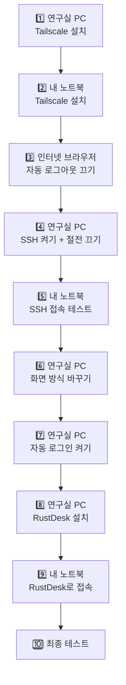

# 🐣 쉬운 가이드: 🐧 우분투 노트북으로 🐧 우분투 연구실 PC 쓰기

> **내 노트북(집 PC)도 우분투**, **연구실 PC도 우분투**일 때 보는 가이드예요.
> 끝까지 따라 하면 집에서 **연구실 바탕화면을 그대로 보면서** 쓸 수 있어요.

⏱ **걸리는 시간**: 약 40분
📍 **어디서**: **연구실에서** 시작하세요. 연구실 PC와 노트북을 둘 다 앞에 두고 해요.
📖 **처음이라면** [시작하기 전에](00-before-you-start.md)를 먼저 읽어 주세요. (터미널 여는 법, 붙여넣기 방법이 나와요)

[← 처음으로](../README.md)

---

## 🗺️ 전체 순서



단계마다 **📍 어느 컴퓨터에서 하는지** 적혀 있어요. 두 컴퓨터가 **둘 다 우분투라서 헷갈리기 쉬우니** 꼭 확인하고 진행하세요.

---

## 1️⃣ 연구실 PC에 Tailscale 설치하기

> 💬 **이게 뭐예요?** Tailscale은 내 컴퓨터들끼리 **비밀 통로**를 만들어 주는 무료 프로그램이에요.
> 학교 밖에서도 연구실 PC를 찾아갈 수 있게 해 줘요.

📍 **연구실 우분투 PC**에서

**① 터미널 열기**: `Ctrl` + `Alt` + `T`

**② 아래 상자를 복사 → 터미널에 붙여넣기(`Ctrl`+`Shift`+`V`) → `Enter`**
```bash
sudo -v
```
→ `[sudo] password for ...:` 가 나오면 **연구실 PC 로그인 비밀번호**를 입력하고 `Enter`를 눌러요. (글자가 안 보이는 게 정상이에요)

**③ 아래 상자를 통째로 복사 → 붙여넣기 → `Enter`**
```bash
sudo apt update
sudo apt install -y curl
curl -fsSL https://tailscale.com/install.sh | sh
sudo tailscale up
```
→ 글자가 쭉 올라가다가 마지막에 이런 줄이 나오고 멈춰요.
```
To authenticate, visit:

        https://login.tailscale.com/a/1a2b3c4d5e
```

**④ 이 주소를 열어요**
주소 위에 마우스를 올리고 **`Ctrl` 누른 채로 클릭**하거나, **마우스 오른쪽 클릭 → 링크 열기**를 누르세요.

**⑤ 브라우저에서 로그인**
- **Sign in with Google** → 내 구글 계정으로 로그인해요.
- **Connect** 버튼이 나오면 눌러요.
- 터미널로 돌아오면 `Success.`가 보여요.

**⑥ 연구실 PC 주소(IP) 확인**
```bash
tailscale ip -4
```
→ `100.`으로 시작하는 숫자가 나와요. **메모 카드에 적어 두세요!** (예: `100.64.12.34`)

✅ **성공**: `100.xx.xx.xx` 숫자가 나왔어요.
❌ **안 되면**:
- `curl: command not found` → ③의 두 번째 줄(`sudo apt install -y curl`)이 실패한 거예요. 인터넷 연결을 확인하고 ③을 다시 해요.
- 주소가 안 열려요 → 주소를 마우스로 드래그해서 복사(`Ctrl`+`Shift`+`C`)한 뒤 브라우저 주소창에 붙여넣어요.

---

## 2️⃣ 내 노트북에 Tailscale 설치하기

📍 **내 우분투 노트북**에서

1️⃣과 **똑같이** 해요. 터미널(`Ctrl` + `Alt` + `T`)을 열고:

```bash
sudo -v
```
(노트북 비밀번호 입력)

```bash
sudo apt update
sudo apt install -y curl
curl -fsSL https://tailscale.com/install.sh | sh
sudo tailscale up
```
→ 나온 주소를 열고 **1️⃣에서 쓴 것과 똑같은 구글 계정**으로 로그인 → **Connect**

**확인하기**
```bash
tailscale status
```

✅ **성공**: 내 노트북과 **연구실 PC 이름이 둘 다** 목록에 보여요.
❌ **안 되면**: 연구실 PC가 목록에 없으면 → 두 컴퓨터에 **다른 구글 계정**으로 로그인한 거예요. 같은 계정으로 다시 로그인하세요. (`sudo tailscale logout` 후 `sudo tailscale up` — **내 노트북에서만!**)

---

## 3️⃣ 자동 로그아웃 끄기 (중요!)

> 💬 **왜 해요?** Tailscale은 보안 때문에 **몇 달마다 다시 로그인하라고** 해요.
> 연구실 PC가 몇 달 뒤 갑자기 연결이 끊기지 않도록 연구실 PC만 이 기능을 꺼요.

📍 **아무 컴퓨터의 인터넷 브라우저**에서

1. 주소창에 **`login.tailscale.com/admin/machines`** 입력 → `Enter` (로그인하라고 하면 같은 구글 계정으로)
2. 컴퓨터 목록에서 **연구실 PC**를 찾아요.
3. 그 줄의 맨 오른쪽 **`...`** 버튼 → **Disable key expiry** 클릭

✅ **성공**: 연구실 PC 이름 아래에 **Expiry disabled**라고 표시돼요.

---

## 4️⃣ 연구실 PC에서 SSH 켜고, 잠들지 않게 하기

> 💬 **SSH가 뭐예요?** 밖에서 연구실 PC에 **명령어를 보낼 수 있게 해 주는 문**이에요. 이 문을 열어 둬요.
> 그리고 연구실 PC가 **절전 모드로 잠들면 밖에서 깨울 수 없어서** 잠들지 않게 설정해요.

📍 **연구실 우분투 PC**에서 (터미널: `Ctrl` + `Alt` + `T`)

**① 비밀번호 먼저 입력**
```bash
sudo -v
```

**② 아래 상자를 통째로 복사 → 붙여넣기(`Ctrl`+`Shift`+`V`) → `Enter`**
```bash
sudo apt install -y openssh-server
sudo systemctl enable --now ssh
sudo systemctl mask sleep.target suspend.target hibernate.target hybrid-sleep.target
gsettings set org.gnome.desktop.session idle-delay 0
gsettings set org.gnome.desktop.screensaver lock-enabled false
systemctl is-active ssh
whoami
```

✅ **성공**: 맨 아래 두 줄이 이렇게 나와요.
```
active        ← SSH가 켜졌다는 뜻
hong          ← 이게 "사용자명"이에요. 메모 카드에 적어 두세요!
```
❌ **안 되면**: `inactive`가 나오면 ②를 한 번 더 붙여넣어 보세요.

---

## 5️⃣ 내 노트북에서 SSH로 접속해 보기

📍 **내 우분투 노트북**에서

1. 터미널 열기: `Ctrl` + `Alt` + `T`
2. 아래를 붙여넣고, `사용자명`과 `100.x.x.x`를 **메모 카드의 내 값으로 바꾼 뒤** `Enter`
   ```bash
   ssh 사용자명@100.x.x.x
   ```
   예: `ssh hong@100.64.12.34`
3. `Are you sure you want to continue connecting` 이 나오면 → **`yes`** 입력 → `Enter`
4. `password:` 가 나오면 → **연구실 PC 로그인 비밀번호** 입력(안 보여요) → `Enter`

✅ **성공**: 맨 아래 줄의 `@` 뒤 이름이 **연구실 PC 이름**으로 바뀌어요.
```
hong@my-laptop:~$        ← 접속 전: 내 노트북
hong@lab-pc:~$           ← 접속 후: 연구실 PC 🎉
```
🎉 **지금 이 창은 연구실 PC예요!** 두 컴퓨터가 모두 우분투라서 모양이 똑같으니, **`@` 뒤의 이름**으로 구분하세요.
연결을 끝내려면 **`exit`** 를 치고 `Enter`를 누르세요.

❌ **안 되면**:
| 화면에 나온 글자 | 해결 |
|---|---|
| `Connection timed out` | 연구실 PC가 켜져 있는지, 2️⃣의 `tailscale status`에 연구실 PC가 보이는지 확인 |
| `Connection refused` | 4️⃣를 다시 해 주세요 |
| `Permission denied` | 사용자명이나 비밀번호가 틀렸어요. 대소문자도 확인하세요 |

---

## 6️⃣ 연구실 PC의 화면 방식 바꾸기

> 💬 **왜 해요?** 우분투의 기본 화면 방식(Wayland)은 원격 프로그램이 **화면을 가져가지 못해요.**
> 그래서 예전 방식(Xorg)으로 바꿔요. **겉보기엔 거의 똑같아요.**
> (접속**당하는** 연구실 PC만 바꾸면 돼요. 내 노트북은 안 바꿔도 돼요.)

📍 **연구실 우분투 PC**에서 (터미널: `Ctrl` + `Alt` + `T`)

**① 비밀번호 먼저 입력**
```bash
sudo -v
```

**② 아래를 통째로 복사 → 붙여넣기 → `Enter`**
```bash
sudo sed -i 's/^#WaylandEnable=false/WaylandEnable=false/' /etc/gdm3/custom.conf
grep WaylandEnable /etc/gdm3/custom.conf
```
✅ 이렇게 **앞에 `#` 없이** 나오면 성공이에요.
```
WaylandEnable=false
```

**③ 재부팅**
```bash
sudo reboot
```
→ 컴퓨터가 다시 켜지면 평소처럼 로그인해요.

**④ 잘 바뀌었는지 확인** (터미널 다시 열고)
```bash
echo $XDG_SESSION_TYPE
```
✅ **성공**: `x11` 이 나와요.
❌ **안 되면**: `wayland`가 나오면 ①~②를 다시 하고, ②의 결과에 `#` 없는 줄이 나오는지 확인하세요.

---

## 7️⃣ 연구실 PC 자동 로그인 켜기

> 💬 **왜 해요?** 연구실 PC가 정전이나 업데이트로 재부팅되면 **로그인 화면에서 멈춰요.**
> 그러면 RustDesk가 화면을 보여 줄 수 없어서, 켜지면 **자동으로 바탕화면까지** 가게 해요.

📍 **연구실 우분투 PC**에서

1. 화면 **오른쪽 위 구석**(전원 아이콘이 있는 곳)을 클릭 → **설정(톱니바퀴 ⚙)**
2. 왼쪽 목록을 아래로 내려서 **사용자** 클릭
3. 오른쪽 위 **잠금 해제** 버튼 → 비밀번호 입력
4. **자동 로그인** 스위치를 **켜요**(파란색)

✅ **성공**: 자동 로그인 스위치가 켜져 있어요.

> ⚠️ **꼭 알아두세요**: 자동 로그인을 켜면 **연구실에 온 누구나 이 PC를 로그인된 상태로 쓸 수 있어요.**
> 연구실을 나갈 때는 **모니터 전원을 꺼 두세요.** (본체는 켜 둬야 해요!)

---

## 8️⃣ 연구실 PC에 RustDesk 설치하기

> 💬 **RustDesk가 뭐예요?** 연구실 PC 화면을 **내 노트북에 그대로 보여 주는** 무료 프로그램이에요.

📍 **연구실 우분투 PC**에서

**① 설치 파일 받기**
1. 인터넷 브라우저(Firefox)를 열고 주소창에 **`github.com/rustdesk/rustdesk/releases/latest`** 입력 → `Enter`
2. 페이지를 **아래로 쭉 내리면** **Assets**라는 목록이 있어요.
3. 이름이 **`rustdesk-숫자-x86_64.deb`** 로 끝나는 파일을 클릭해서 받아요.
   (예: `rustdesk-1.4.2-x86_64.deb`) ⚠️ `aarch64`, `.rpm`, `.AppImage`, `.flatpak` 은 **아니에요.**

**② 설치하기** (터미널: `Ctrl` + `Alt` + `T`)
```bash
sudo apt install -y "$(xdg-user-dir DOWNLOAD)"/rustdesk-*-x86_64.deb
```
✅ 마지막에 에러 없이 끝나면 설치된 거예요.

**③ RustDesk 실행하기**
화면 **왼쪽 아래 점 9개 버튼(⋮⋮⋮)** → 위쪽 검색창에 **`rustdesk`** 입력 → RustDesk 아이콘 클릭

**④ 설정하기**
1. RustDesk 창에서 내 **ID 옆의 `⋮`(점 3개)** 또는 **설정(⚙)** 을 눌러 설정 화면을 열어요.
2. 왼쪽에서 **보안 (Security)** 을 눌러요.
3. **보안 설정 잠금 해제 (Unlock Security Settings)** → 비밀번호를 물어보면 연구실 PC 비밀번호 입력
4. **IP 직접 접근 허용 (Enable direct IP access)** 에 **체크** ✅
5. 비밀번호 부분에서 **영구 비밀번호 사용 (Use permanent password)** 선택 → **영구 비밀번호 설정 (Set permanent password)** → 새 비밀번호를 **두 번** 입력 → 확인
   - 이 비밀번호는 **메모 카드에 적어 두세요.** (연구실 PC 로그인 비밀번호와 **다르게** 하는 걸 추천해요)

> 버전에 따라 메뉴 이름이나 위치가 조금 다를 수 있어요. 비슷한 이름을 찾아 주세요.

✅ **성공**: "IP 직접 접근"이 체크되어 있고, 영구 비밀번호를 설정했어요.

---

## 9️⃣ 내 노트북에서 RustDesk로 연구실 화면 보기 🎉

📍 **내 우분투 노트북**에서

**① RustDesk 설치하기**
8️⃣의 **①~③과 똑같이** 노트북에도 설치하고 실행해요.
```bash
sudo apt install -y "$(xdg-user-dir DOWNLOAD)"/rustdesk-*-x86_64.deb
```
(노트북은 접속**하는** 쪽이라 6️⃣ 화면 방식 바꾸기, 8️⃣-④ 설정은 **안 해도 돼요.**)

**② 연결하기**
1. RustDesk 창 오른쪽의 **원격 데스크톱 제어 (Control Remote Desktop)** 입력칸에 **연구실 PC의 Tailscale IP**(`100.x.x.x`)를 입력해요.
2. **연결 (Connect)** 클릭
3. 비밀번호 창이 나오면 → 8️⃣에서 정한 **RustDesk 영구 비밀번호** 입력 → 확인

✅ **성공**: **연구실 PC 바탕화면이 창으로 보여요!** 마우스와 키보드로 그대로 조작할 수 있어요. 🎉

💡 **쓰는 팁**
- 창 위쪽 도구 모음에서 **전체 화면**으로 바꿀 수 있어요.
- 다 쓰면 **RustDesk 창만 닫으면** 돼요. (연구실 PC는 계속 켜져 있어요)
- 두 컴퓨터가 모두 우분투라서 **전체 화면일 때 어느 컴퓨터인지 헷갈리기 쉬워요.** 전체 화면을 풀려면 도구 모음을 사용하세요.

❌ **안 되면**:
| 증상 | 해결 |
|---|---|
| 연결이 안 돼요 | 8️⃣-④에서 **IP 직접 접근 허용**을 체크했는지 확인 / 5️⃣ SSH 접속이 되는지 먼저 확인 |
| 검은 화면만 보여요 | 연구실 PC에서 6️⃣ 화면 방식 바꾸기를 다시 확인 (`echo $XDG_SESSION_TYPE` → `x11` 이어야 해요) |
| 비밀번호가 틀리대요 | 연구실 PC **로그인 비밀번호가 아니라** RustDesk **영구 비밀번호**를 넣어야 해요 |

---

## 🔟 최종 테스트 (연구실을 떠나기 전에 꼭!)

> 💬 **왜 해요?** 집에 가서 안 되면 다시 연구실에 와야 하니까, **지금** 확인해요.

**① 재부팅 테스트**
1. 📍 **연구실 PC**에서 오른쪽 위 전원 아이콘 → **다시 시작**
2. 연구실 PC를 **건드리지 말고** 3분 기다려요. (자동 로그인이 돼서 바탕화면까지 저절로 켜져야 해요)
3. 📍 **내 노트북**에서 RustDesk로 연결 → **화면이 보이면 성공** ✅
4. 📍 **내 노트북** 터미널에서 `ssh 사용자명@100.x.x.x` → **접속되면 성공** ✅

**② 학교 밖에서 되는지 테스트**
노트북 와이파이를 **휴대폰 핫스팟**으로 바꾼 뒤 RustDesk로 다시 연결해 보세요. 이게 되면 집에서도 돼요!

**③ 연구실 사람들에게 알리기**
연구실 PC에 **"원격으로 쓰는 중이에요. 전원을 끄지 말아 주세요 🙏"** 메모를 붙여 두세요.

**④ 모니터 끄기**
본체는 켜 두고 **모니터만** 꺼요.

**⑤ 집 PC에서도 쓰려면**
집 PC에서 **2️⃣, 5️⃣, 9️⃣만** 한 번 더 하면 돼요. (연구실 PC 설정은 다시 안 해도 돼요)

---

## 📅 매일 쓰는 법 (이것만 기억하세요)

| 하고 싶은 것 | 방법 |
|---|---|
| 🖥️ **연구실 화면 보기** | RustDesk 실행 → `100.x.x.x` 입력 → 연결 → RustDesk 비밀번호 |
| ⌨️ **명령어로 접속** | 터미널 → `ssh 사용자명@100.x.x.x` → 비밀번호 |
| 🚪 **다 쓰고 나올 때** | RustDesk 창 닫기 / SSH는 `exit` |

---

## 🚫 절대 하지 마세요

| ❌ 하면 안 되는 것 | 😱 왜? | ✅ 대신 |
|---|---|---|
| 연구실 PC **"전원 끄기"** 누르기, SSH에서 `sudo shutdown now` / `poweroff` | 꺼진 PC는 **집에서 다시 켤 방법이 없어요.** 연구실에 가야 해요 | **"다시 시작"**, `sudo reboot`만 쓰세요 |
| 연구실 PC의 **Tailscale 끄기, 로그아웃** (`sudo tailscale down`) | 비밀 통로가 끊겨서 접속할 수 없어요 | 연구실 PC의 Tailscale은 건드리지 마세요 |
| 연구실 PC **절전 모드 다시 켜기** | 잠들면 깨울 수 없어요 | 그대로 두세요 |
| SSH로 **오래 걸리는 작업**을 돌리고 노트북 덮기 | 연결이 끊기면 **작업도 같이 멈춰요** | RustDesk 화면에서 실행하거나 [tmux](../guides/05-tips.md#tmux)를 쓰세요 |
| IP, 비밀번호를 **카톡방, 깃허브에 올리기** | 다른 사람이 연구실 PC에 들어올 수 있어요 | 메모 카드는 나만 보기 |

> 👀 RustDesk로 접속해 있는 동안 **연구실 모니터에도 내 화면이 똑같이 보여요.** 개인 메일이나 메신저를 볼 때는 연구실 모니터가 꺼져 있는지 확인하세요.
>
> 🤔 두 컴퓨터가 모두 우분투라서 **"내 노트북을 끄려다 연구실 PC를 끄는"** 실수가 흔해요. 끄기 전에 **`@` 뒤 이름**이나 **RustDesk 창인지** 꼭 확인하세요.

---

## ➡️ 익숙해지면 해 볼 것

| 하고 싶은 것 | 보러 가기 |
|---|---|
| SSH 접속할 때 **비밀번호 안 치기** (명령어 한 줄!) | [자세한 가이드 4장](../guides/03-ubuntu-to-ubuntu.md#key) |
| `ssh lab`처럼 **짧게 접속하기** | [자세한 가이드 5장](../guides/03-ubuntu-to-ubuntu.md#config) |
| **VS Code**로 연구실 PC 코드 편집하기 ⭐ | [편하게 쓰기](../guides/05-tips.md#vscode) |
| 노트북을 덮어도 **학습이 계속 돌게** 하기 | [tmux 사용법](../guides/05-tips.md#tmux) |
| **파일 주고받기** (파일 관리자로 드래그!) | [자세한 가이드 7장](../guides/03-ubuntu-to-ubuntu.md#files) |
| 주의사항 **전부** 보기 | [주의사항 총정리](../guides/07-cautions.md) |

📖 모르는 단어가 있으면 → [용어 사전](glossary.md)

[← 처음으로](../README.md)
